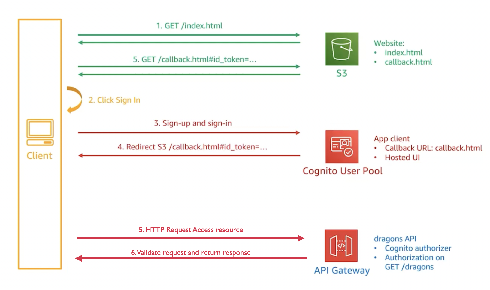

# Building Modern Python Applications on AWS

Welcome to my project for the edx course, "Building Modern Python Applications on AWS".

## Week 2

Week 2 focuses on integrating Amazon Cognito for robust user authentication, setting up a streamlined workflow using Amazon API Gateway, and ensuring secure API access with an Amazon Cognito authorizer. Here’s a detailed breakdown of the architecture:

### Components:
- **Client:** Represents the user's interface, in this case it is the AWS cognito hosted UI.
- **Amazon S3:** Utilized for hosting static website content. It serves `index.html` which is the entry point of the client-side application.
- **Amazon Cognito User Pool:** Manages user directories, handling sign-up, sign-in, and token refresh processes. It securely manages user data including usernames, passwords, and various user attributes.
- **Amazon API Gateway:** Acts as a single entry point for all incoming API requests. It simplifies API execution and management, allowing developers to focus on writing code.
- **Amazon Cognito Authorizer:** Functions as a gatekeeper for your APIs, leveraging Amazon Cognito to authenticate and authorize API calls. It ensures that only authenticated users can access your APIs.
- **Dragons API:** A backend service developed to manage dragon data. It interfaces with the Amazon API Gateway and handles specific business logic related to dragons.

### Workflow:
1. **User Interaction:** Users interact with the client application hosted on Amazon S3, initiating requests by visiting `index.html`.
2. **Authentication:** When users attempt to access protected resources, they are authenticated through Amazon Cognito User Pool.
3. **API Access:** Once authenticated, users can make requests to the Dragons API through Amazon API Gateway, which uses the Cognito Authorizer for security.
4. **Data Handling:** The Dragons API processes these requests, performing actions such as retrieving, adding, or updating dragon data.

### CI/CD and Testing:
- **Continuous Integration (CI):** We use GitHub Actions to run automated tests and ensure that integrations meet our standards before deployment.
- **Postman Tests:** Automated API tests are executed to verify the functional behavior of the Dragons API, ensuring robustness and reliability.

This architecture not only secures the application but also ensures that it remains scalable and maintainable. Week 2 has laid a solid foundation for secure API interactions and streamlined deployment processes.
