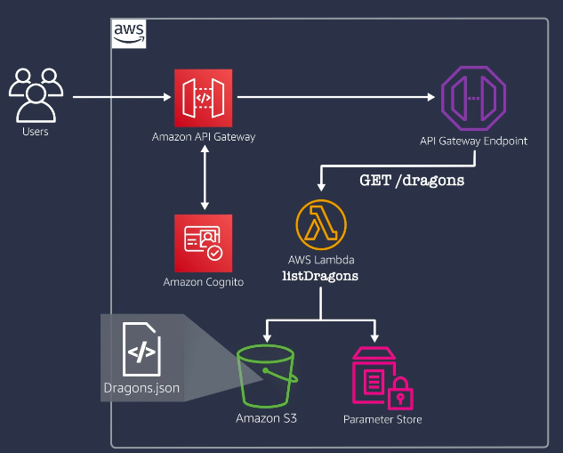

# Building Modern Python Applications on AWS

Welcome to my project for the edX course, "Building Modern Python Applications on AWS".

## Week 4

Week 4 builds upon the progress from Week 3 by introducing two additional AWS Lambda functions, `validateDragon` and `addDragon`, to enhance the functionality of the Dragons API. This week, we also ensure comprehensive testing coverage for these new functions.

### Components:
- **Amazon API Gateway**: Acts as the single entry point for all API requests, routing them to the appropriate backend services.
- **Amazon Cognito**: Manages user authentication and authorization.
- **AWS Lambda (`listDragons`, `validateDragon`, `addDragon` functions)**: Handles GET requests to retrieve dragon data, validates dragon data, and handles POST requests to add new dragons.
- **Amazon S3**: Stores the `Dragons.json` file, which contains information about dragons.
- **AWS Systems Manager (Parameter Store)**: Stores configuration parameters such as the S3 bucket name and file name.

### Workflow:
1. **User Interaction**: Users interact with the API through the Amazon API Gateway, initiating requests to retrieve, validate, and add dragon data.
2. **Authentication**: Users are authenticated via Amazon Cognito.
3. **API Gateway Processing**: The API Gateway routes the authenticated requests to the appropriate Lambda function (`listDragons`, `validateDragon`, or `addDragon`).
4. **Data Retrieval and Manipulation**: 
   - **listDragons**: Retrieves the S3 bucket name and file name from the Parameter Store, reads the `Dragons.json` file from S3, processes the data, and returns it to the user.
   - **validateDragon**: Validates the input data for adding a new dragon.
   - **addDragon**: Validates the input data using the `validateDragon` function and, if valid, updates the `Dragons.json` file in S3 with the new dragon information.

### CI/CD and Testing:
- **Continuous Integration (CI)**: GitHub Actions are used to automate the testing and deployment process.
- **Unit Testing with Stubbing**: We use pytest and boto3's Stubber for unit testing, ensuring the Lambda functions behave correctly by stubbing out AWS service calls.
- **Integration Testing with Postman**: Postman is used to run comprehensive integration tests, verifying the API's functionality and behavior in real-world scenarios.

### Lambda Functions Added:
1. **listDragons**: Handles GET requests to retrieve dragon data.
2. **validateDragon**: Validates the dragon data before adding it.
3. **addDragon**: Handles POST requests to add new dragons, utilizing the `validateDragon` function for data validation.

### CI/CD Pipeline:

The CI/CD pipeline ensures that every change is tested and deployed automatically, maintaining the integrity and functionality of the API.

This week's focus has been on integrating additional Lambda functions for validating and adding dragon data, transitioning from mock testing to stubbing for more accurate unit tests, and ensuring robust integration testing with Postman. These updates enhance the functionality, reliability, and scalability of the Dragons API.
