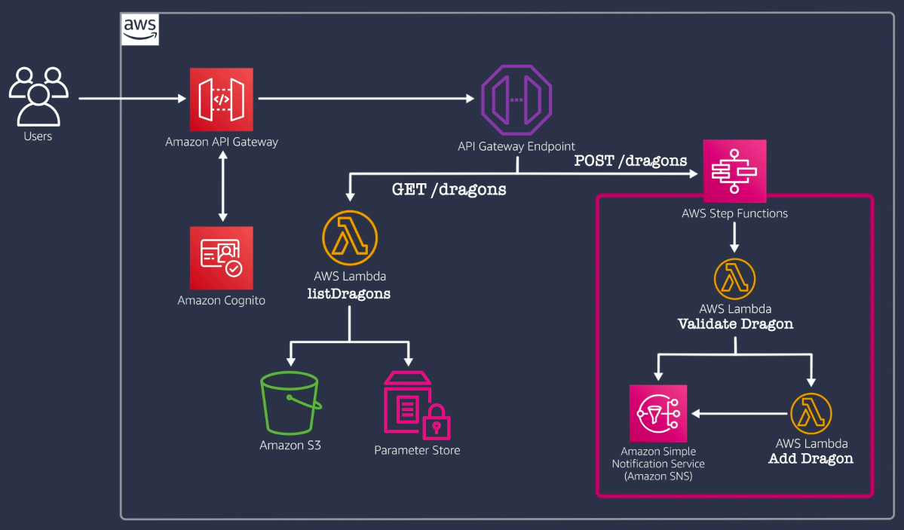

# Building Modern Python Applications on AWS

Welcome to my project for the edx course, "Building Modern Python Applications on AWS".

## Final Architecture
The diagram above illustrates the final architecture of the project. It shows how different AWS services like Lambda, API Gateway, S3, Step Functions, and others integrate to form a complete serverless application. Here's a brief overview:

- **Amazon API Gateway**: Serves as the entry point for the application, managing and routing incoming requests.
- **AWS Lambda**: Contains the business logic, with functions like `listDragons` for retrieving data and `validateDragon` & `addDragon` for processing new entries.
- **Amazon S3**: Used for storing persistent data, such as a database of dragons or user-uploaded content.
- **AWS Step Functions**: Orchestrates the workflow between different Lambda functions, especially in handling more complex operations like adding new dragons.
- **Parameter Store**: Manages configuration data and secrets, ensuring secure access to vital application parameters.
- **Amazon SNS**: Facilitates message broadcasting and subscription, useful for notifications or inter-service communication.

This setup is designed for high availability and scalability, leveraging the fully managed services provided by AWS.
