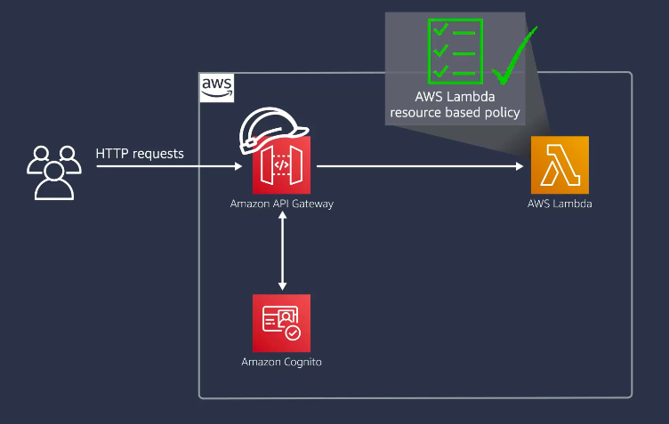

# Building Modern Python Applications on AWS

Welcome to my project for the edx course, "Building Modern Python Applications on AWS".

## Week 3

Week 3 focuses on enhancing our Dragons API by introducing AWS Lambda functions to handle GET requests, moving from mock testing to stubbing, and integrating Postman for comprehensive integration testing. Here's a detailed breakdown of the architecture and the new components introduced this week:

### Components:
- **Amazon API Gateway**: Acts as the single entry point for all API requests, routing them to the appropriate backend services.
- **Amazon Cognito**: Manages user authentication and authorization.
- **AWS Lambda (`listDragons` function)**: Handles GET requests to retrieve dragon data. This serverless function processes the request and interacts with other AWS services.
- **Amazon S3**: Stores the `Dragons.json` file, which contains information about dragons.
- **AWS Systems Manager (Parameter Store)**: Stores configuration parameters such as the S3 bucket name and file name.

### Workflow:
1. **User Interaction**: Users interact with the API through the Amazon API Gateway, initiating requests to retrieve dragon data.
2. **Authentication**: Users are authenticated via Amazon Cognito.
3. **API Gateway Processing**: The API Gateway routes the authenticated requests to the `listDragons` Lambda function.
4. **Data Retrieval**: The Lambda function retrieves the S3 bucket name and file name from the Parameter Store, reads the `Dragons.json` file from S3, processes the data, and returns it to the user.

### CI/CD and Testing:
- **Continuous Integration (CI)**: GitHub Actions are used to automate the testing and deployment process.
- **Unit Testing with Stubbing**: We use pytest and boto3's Stubber for unit testing, ensuring the Lambda function behaves correctly by stubbing out AWS service calls.
- **Integration Testing with Postman**: Postman is used to run comprehensive integration tests, verifying the API's functionality and behavior in a real-world scenario.

### CI/CD Pipeline:

The CI/CD pipeline ensures that every change is tested and deployed automatically, maintaining the integrity and functionality of the API.

This week's focus has been on integrating AWS Lambda for efficient request handling, transitioning from mock testing to stubbing for more accurate unit tests, and ensuring robust integration testing with Postman. These updates enhance the functionality, reliability, and scalability of the Dragons API.
