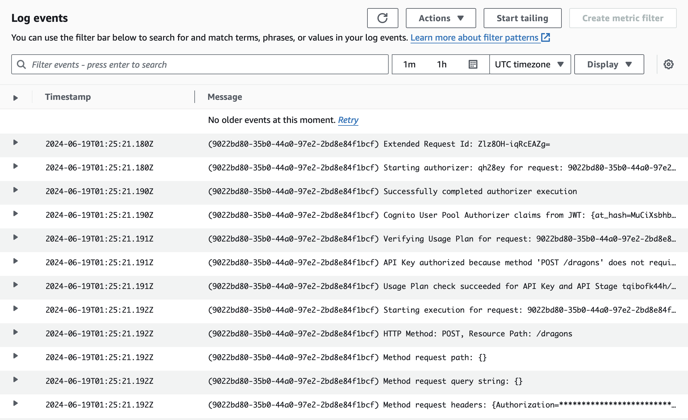

# Building Modern Python Applications on AWS

Welcome to my project for the edX course, "Building Modern Python Applications on AWS".

## Week 6 : Final Week

Week 6 focuses on optimizing our application by monitoring and collecting logs and metrics. This includes integrating AWS X-Ray for tracing and enabling API Gateway caching to enhance performance. Here’s a summary of the tasks and updates:

### Components:
- **Amazon API Gateway**: Acts as the single entry point for all API requests, routing them to the appropriate backend services.
- **Amazon Cognito**: Manages user authentication and authorization.
- **AWS Lambda (`listDragons`, `validateDragon`, `addDragon` functions)**: Handles GET and POST requests to retrieve, validate, and add dragon data.
- **Amazon S3**: Stores the `Dragons.json` file, which contains information about dragons.
- **AWS Systems Manager (Parameter Store)**: Stores configuration parameters such as the S3 bucket name and file name.
- **AWS Step Functions**: Orchestrates workflows between the Lambda functions.
- **AWS X-Ray**: Provides tracing for the Lambda functions and API Gateway to monitor performance and diagnose issues.
- **Amazon CloudWatch**: Collects and monitors logs and metrics from API Gateway, Lambda, and Step Functions.

### Monitoring and Logging:
1. **AWS X-Ray**:
   - **Integration**: X-Ray is enabled on the `listDragons` Lambda function and API Gateway to provide detailed traces of API calls.
   - **Benefits**: Helps in identifying performance bottlenecks, understanding application behavior, and diagnosing issues by tracing requests across services.
   - **Example Trace**:
     

2. **Amazon CloudWatch**:
   - **Integration**: Collects logs and metrics from API Gateway, Lambda functions, and Step Functions.
   - **Benefits**: Provides centralized logging, real-time monitoring, and alerting capabilities, helping maintain application health and performance.
   - **Example Log**:
     

3. **Step Functions Orchestration**:
   - **Integration**: Step Functions are used to orchestrate workflows between Lambda functions.
   - **Monitoring**: CloudWatch monitors the state transitions and execution of Step Functions, providing insights into workflow performance and errors.

4. **API Gateway Caching**:
   - **Integration**: Enables caching in API Gateway to reduce latency and backend load by caching API responses.
   - **Benefits**: Improves response times and reduces the number of requests to Lambda functions, enhancing overall performance.

### Workflow:
1. **User Interaction**: Users interact with the API through the Amazon API Gateway, initiating requests to retrieve, validate, and add dragon data.
2. **Authentication**: Users are authenticated via Amazon Cognito.
3. **API Gateway Processing**: The API Gateway routes the authenticated requests to the appropriate Lambda function (`listDragons`, `validateDragon`, or `addDragon`).
4. **Data Retrieval and Manipulation**:
   - **listDragons**: Retrieves the S3 bucket name and file name from the Parameter Store, reads the `Dragons.json` file from S3, processes the data, and returns it to the user.
   - **validateDragon**: Validates the input data for adding a new dragon.
   - **addDragon**: Validates the input data using the `validateDragon` function and, if valid, updates the `Dragons.json` file in S3 with the new dragon information.
5. **Monitoring and Logging**: X-Ray and CloudWatch monitor and collect logs and metrics, providing insights into application performance and health.

This week's focus has been on integrating monitoring and logging tools to ensure the application is robust, reliable, and scalable, providing a seamless user experience.
